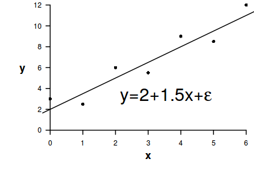

# Section 1 {#Section1}

## Subsection

We can refer back to [Section 1](#Section1) or even to
an external resource like <http://www.flutterbys.com.au/stats> or [this](http://www.flutterbys.com.au/stats).

- unordered list item that makes an **important point**
   - a subitem
- another list item, also with an *important point*

***
1. An enumerated list item
   i) a subitem

***



***

R code is included between special tags/markers

```{r}
a = 1
a
```

***

Equations are included between single \$ (for inline equations) and double \$\$ for blocked equations like:

$$y_i \sim{} N(0, \sigma^2) $$
where $y_i$ is the response.

***

# Compact layout {.tabset .tabset-fade}

## Tab 1
Some content

## Tab 2
Some other content